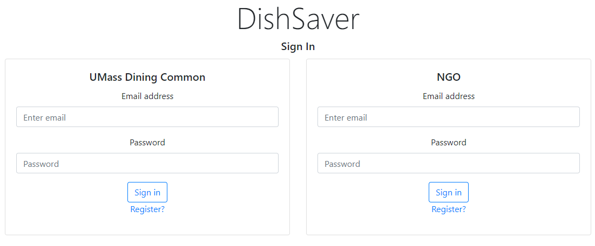
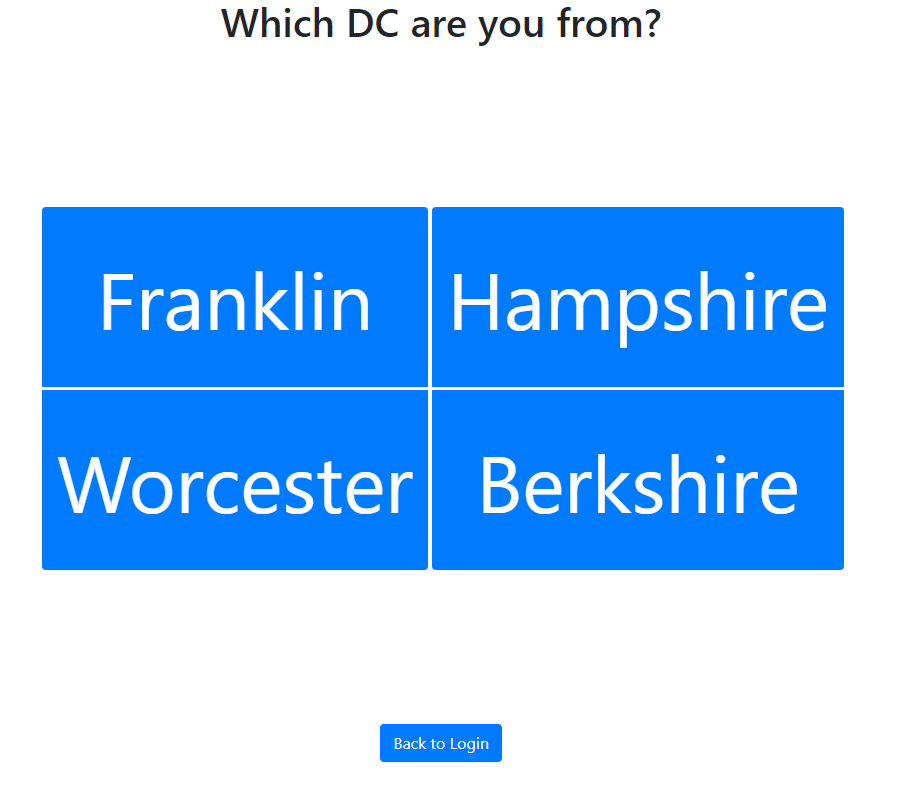
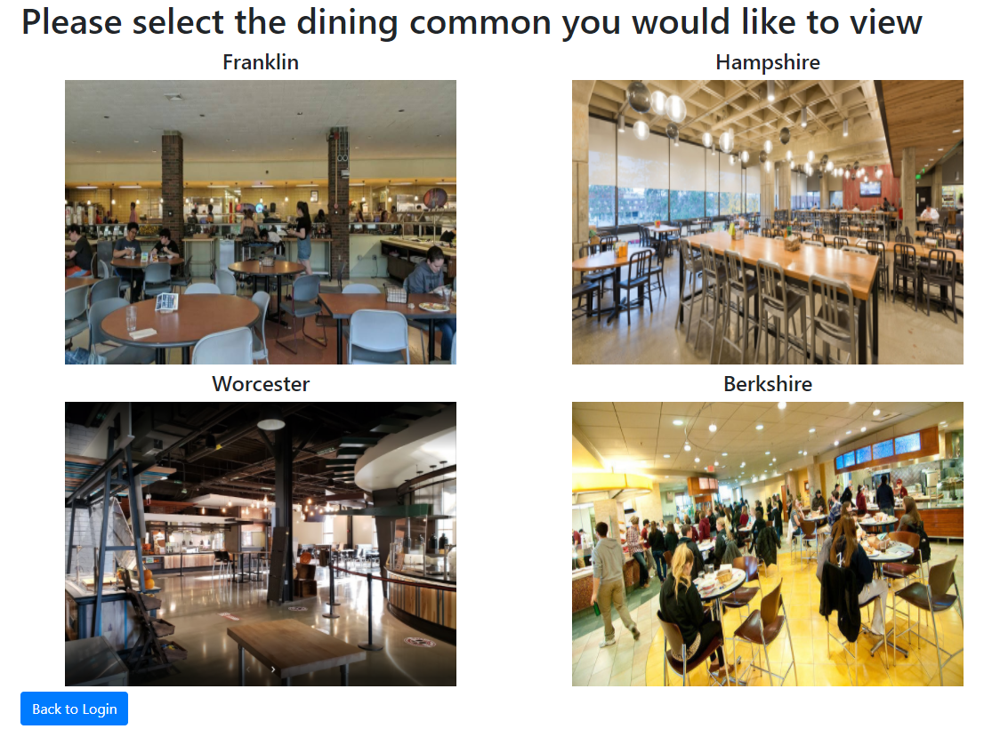
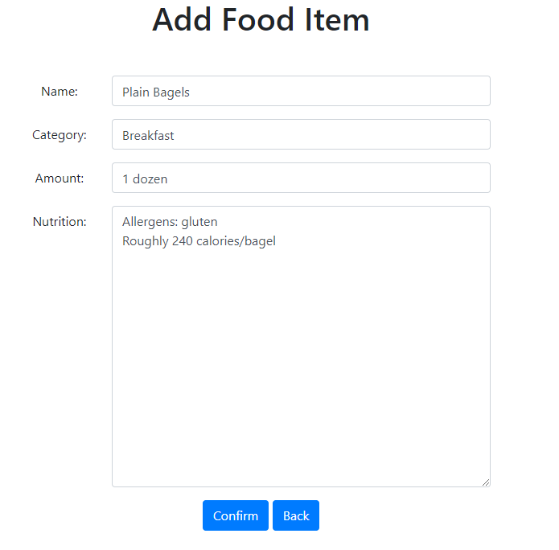
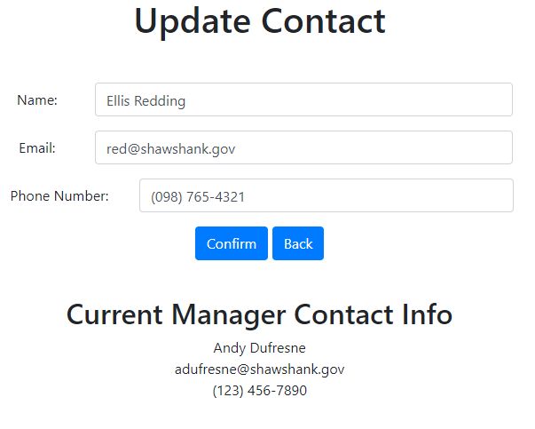
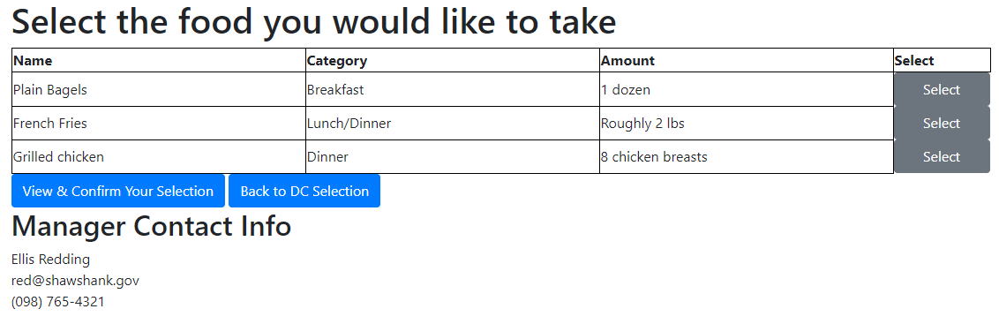
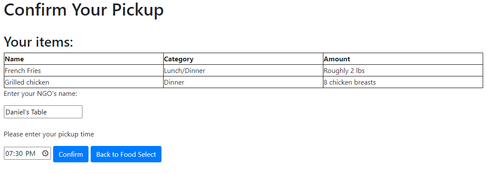
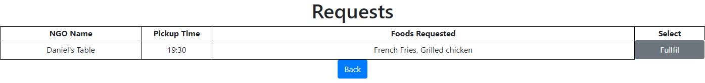

## Title: Chi Team

## Subtitle: DishSaver

## Semester: Fall 2020

## Overview:
DishSaver allows UMass Dining Commons to easily and effectively communicate with NGO's (non-governmental organizations, also known as nonprofit organizations) about donating leftover food so that it may help those in needs rather than being wasted. This application allows DC's to put up food that is available, and then NGO's may request to take whichever items they choose. DishSaver is an innovative application because there are no mainstream/popular applications similar to it and it helps to simplify and automate an existing task.

## Team Members:
* Alex Hickey, GitHub: alexhickey09
* Alex Preston, GitHub: alexp367
* Roshan Shetty, GitHub: RoshanPShetty

## User Interfaces:
### Sign in/Register

Allows existing users to sign in to the application or new users to register an account (the signin UI is pictured above but the register UI looks very similar).

### DC Home Page

The DC Home Page UI allows DC employees to select which DC they work at.

### NGO Home Page

The NGO Home Page UI allows NGO's to select which DC they would like to view.

### Add Food

This UI lets DC's make a leftover food item available to NGO's. Information they may provide are: Name of food, Category of food (can be meal such as breakfast or type of food such as vegetable), Amount (by quantity, weight, portions, etc.), and Nutritional Information.

### Update Contact

Allows the DC to update their contact information so the NGO's may reach them with any inquiries they may have.

### Select Food

Allows NGO's to select whichever food items they want. They can also see the contact info for the DC they selected on this screen.

### Pickup Confirmation

Allows NGO's view all of the items they have selected and prompts them to enter the name of their NGO as well as the time they will pick up the food. In the example picture, the user selected "French Fries" and "Grilled chicken" from the available foods shown in the 'Select Food' example screenshot.

### Requests

Allows DC's to view all current requests that have been made. Once an NGO has picked up their requested food, the DC may click the fulfill button to remove the request from the table. 

## APIs
* `/login` allows users to login   
* `/register` allows new users to signup
* `/addfood` posts a new food for the given DC, including, the following information for the food: name, category, amount, nutritional information
* `/viewfood` shows all available food for the selected DC
* `/updatecontact` updates the contact info for the selected DC
* `/viewcontact` views the contact info for the selected DC
* `/addToSelection` adds the selected food to the list of food for the current request, or the "cart"
* `/selectedFood` gives all of the food in the current selection, or "cart"
* `/makeRequest` confirms the current selection and makes it a request. This takes the NGO's: name, time of pickup, food items chosen. This also removes all of the chosen food from the DC's list of available food to prevent multiple NGO's from selecting the same food.
* `/fulfillRequest` completes/removes the selected request
* `/viewrequests` shows all current requests at the selected DC

## Database:
* We used a MongoDB cluster and created a database which has 5 collections: `contact`, `food`, `selection`, `requests`, and `users`.
* Below is a brief description of each collection, including what an entry within each collection consists of and the relationships between collections/entries, including an example/prototype entry.
  
### Contact:
    * Stores the contact information for the Dining Commons.
    * Format: Name, Email, Phone.
    * Example:
      contact document { 
          _id: <Object ID>
          name: String, //Name of contact
          email: String, //Email of contact
          phone: String, //Phone number of contact
          dc: String //DC at which contact works
      }
    * Relationships: None.
### Food:
    * Stores information about each food item available.
    * Format: Name, Category, Amount, Nutrition, DC.
    * Example:
      food document { 
          _id: <Object ID>
          name: String, //Name of food
          category: String, //Category of food (breakfast, dinner, ...)
          amount: String, //Quantity of food available
          nutrition: String, //Nutritional information for food
          dc: String //DC at which food is available
      }
    * Relationships: Food items are converted into a selection entry once an NGO selects them.
### Selection:
    * Stores the user's current selection (similar to a checkout cart).
    * Format: Array of food items containing Name, Category, Amount.
    * Example:
      selection document { 
          _id: <Object ID>
          name: String, //Name of food item
          category: String, //Category of food (breakfast, dinner, ...)
          amount: String, //Quantity of food available
      }
    * Relationships: Selection takes entries from food once an NGO selects an item. A selection is converted to a request, along with the NGO's name and pickup time, once an NGO confirms their selection.
### Requests:
    * Stores the info about the ngo and pickup as well as the food being taken.
    * Format: Name, Time, Food Array, DC
    * Example:
      contact document { 
          _id: <Object ID>
          name: String, //Name of the NGO making the request
          time: String, //Time the NGO will pickup their food
          foods: Array, //Array containing the names of all the food the NGO has selected
          dc: String //DC for which the NGO is making a request
      }
    * Relationships: Requests are formed from a selection, along with the NGO's name and pickup time, once an NGO confirms their selection.
### Users:
    * Stores the email and password of registered users.
    * Format: Email, Password Array
    * Example:
      contact document { 
          _id: <Object ID>
          username: String, //Email of the registered user
          password: Array //Containing the encrypted salt and hash of the password
      }
    * Relationships: None.

## URL Routes/Mappings

## Authentication/Authorization:

## Division of Labor:

## Conclusion: