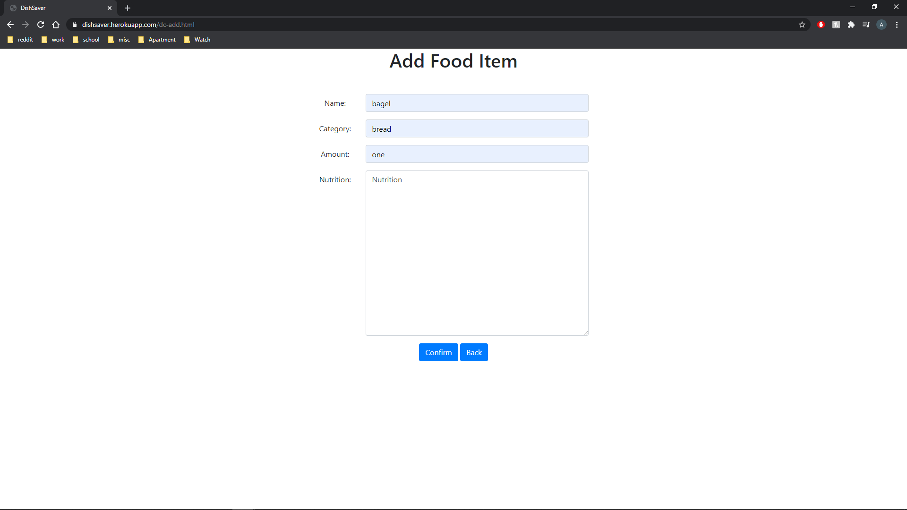
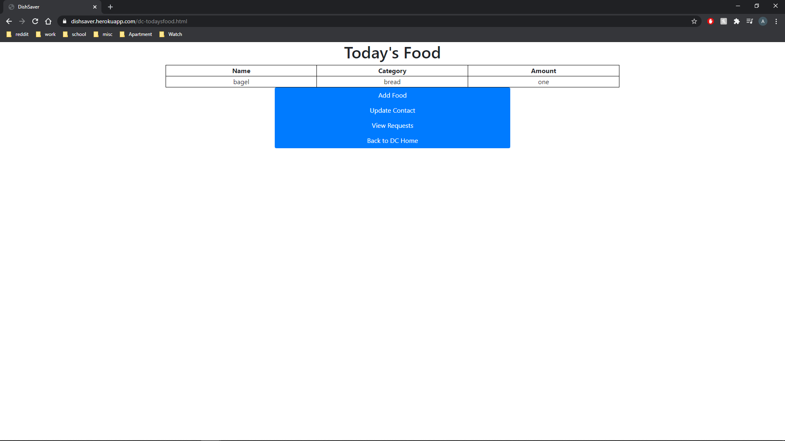
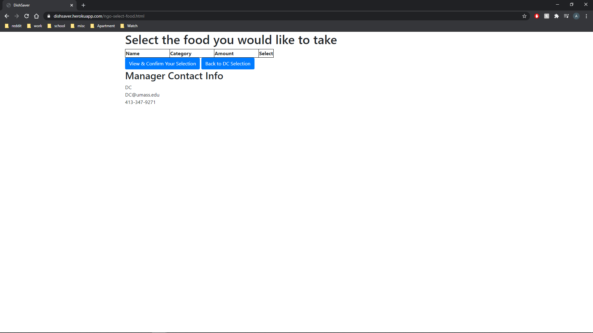
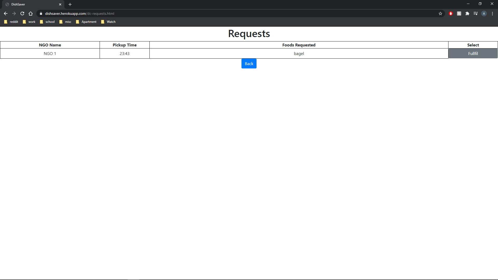
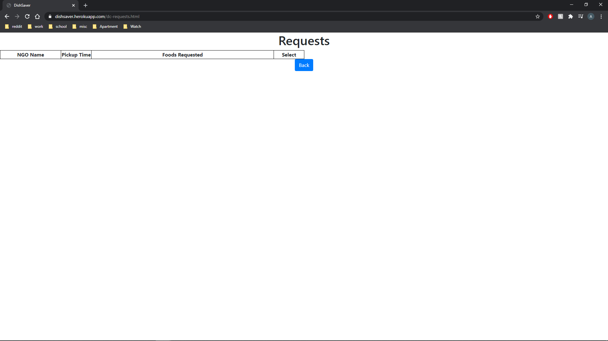

*   API Planning:
    * /login allows users to login   
    * /register allows new users to signup
    * /addfood posts a new food to the list requires the dc, nutritional information, quantities
    * /updatecontact updates the contact info for the given dc
    * /viewcontact views contact info for given dc
    * /makeRequest creates a new food request
    * /viewrequest shows what food has been requested in a chosen request
    * /viewfood shows all available food for a dc
    * /fulfillrequest removes the indicated request once it is fulfilled
    * /viewrequests gives all current requests
    * /selectedFood gives the food currently being requested
    * /addToSelection adds the current selected food to the list of food for the current request

    Create
    
    

    Upon confirming the details of a food that food is then added to the list of available food.

    Read
    

    Upon clicking the view requests button in the dc interface it gives a list of all requests with their name, time of pickup, and food requested.

    Update
    
    

    When you confirm the contact details it will update the contact info on the NGO page.

    Delete
    
    

    When you click the fulfill button it will remove the request from the list of requests.